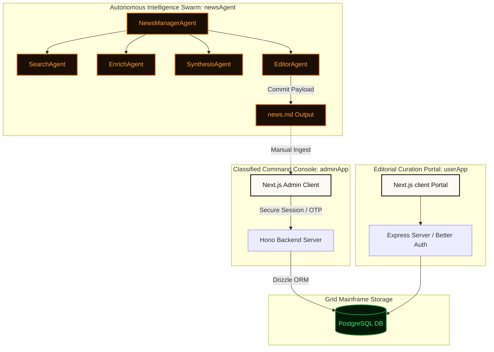

```text
 ██████╗ ███████╗██╗   ██╗    ███╗   ██╗███████╗██╗    ██╗███████╗
 ██╔══██╗██╔════╝██║   ██║    ████╗  ██║██╔════╝██║    ██║██╔════╝
 ██║  ██║█████╗  ██║   ██║    ██╔██╗ ██║█████╗  ██║ █╗ ██║███████╗
 ██║  ██║██╔══╝  ╚██╗ ██╔╝    ██║╚██╗██║██╔══╝  ██║███╗██║╚════██║
 ██████╔╝███████╗ ╚████╔╝     ██║ ╚████║███████╗╚███╔███╔╝███████║
 ╚═════╝ ╚══════╝  ╚═══╝      ╚═╝  ╚═══╝╚══════╝ ╚══╝╚══╝ ╚══════╝
 ░░░░░░░░░░░░░░░░░ NEXUS CORE COMMAND DECK ░░░░░░░░░░░░░░░░░░░░
```

# DEV.NEWS — Nexus Core Command Terminal

> [!IMPORTANT]
> **OPERATIVE DISCIPLINE REQUIRED.** You are accessing the **DEV-NEWS-Nexus-Core-Command-Terminal**. This workspace coordinates an autonomous, multi-agent intelligence swarm, a Win95/CRT-style tactical administration dashboard, and a premium editorial dispatch portal.

---

## 📡 SYSTEM TELEMETRY DECK

| Metric | System State | Signature |
| :--- | :--- | :--- |
| **Clearance Level** | `LEVEL 4 (CLASSIFIED)` | `0xEF99A2` |
| **Grid Status** | `ONLINE / SYNCED` | `🟢 ACTIVE` |
| **Core Processor** | `@openai/agents SDK` | `Ollama Cloud (nemotron-3-ultra)` |
| **Visual Framework** | `CRT / Scanline / Manila Dossier` | See [DESIGN.md](file:///D:/news/DESIGN.md) |

---

## 🗺️ GRID TOPOLOGY



---

## 📂 SUB-SYSTEM DIRECTORY DOSSIERS

### 🛰️ [newsAgent](file:///D:/news/newsAgent) — Autonomous Curation Swarm
Operates a sequential parent-child LLM agent workflow configured to scrape hacker updates, trending releases, exploits, and academic briefs, compiling them into ranked dispatch feeds.
- **Coordination Hub:** [newsAgent/index.js](file:///D:/news/newsAgent/index.js) runs the core orchestration logic.
- **Architectural Specs:** Read [newsAgent/system_architecture.md](file:///D:/news/newsAgent/system_architecture.md) for data flow specifications.
- **Output Vault:** [news.md](file:///D:/news/newsAgent/news.md) holds the raw telemetry outputs compiled by the editor agent.

### 🎛️ [adminApp](file:///D:/news/adminApp) — Classified Command Terminal
The Win95/Y2K-themed operational environment allowing grid operators to audit, write, and purge Chronicles dispatches.
- **Hono Backend Node Engine:** [adminApp/server](file:///D:/news/adminApp/server) coordinates session access, PostgreSQL schemas, and route validators.
- **Next.js Web Command Client:** [adminApp/client](file:///D:/news/adminApp/client) displays CRT sweeps, interactive folders, and telemetry metrics.
- **Sub-System Readme:** Read [adminApp/README.md](file:///D:/news/adminApp/README.md) for environment presets.

### 📖 [userApp](file:///D:/news/userApp) — DevBits Editorial Portal
A sleek, cormorant garamond serif-based user interface following warm-editorial design systems, allowing authorized operatives to review active broadcasts.
- **User Portal Client:** [userApp/client/web](file:///D:/news/userApp/client/web) handles bookmarks, profiles, and feeds.
- **Express Backend Adapter:** [userApp/server](file:///D:/news/userApp/server) manages Better Auth tokens and secure PostgreSQL transactions.
- **Sub-System Readme:** Read [userApp/client/web/README.md](file:///D:/news/userApp/client/web/README.md) for auth configurations.

---

## 🧮 CURATION SWARM MATHEMATICS

To maintain signal integrity and strip out low-value alerts, the [SynthesisAgent](file:///D:/news/newsAgent/agents/synthesisAgent.js) grades gathered reports using the following scoring framework:

$$\text{Final Score} = 0.40 \times \text{Impact} + 0.25 \times \text{Community} + 0.20 \times \text{Freshness} + 0.15 \times \text{Source Authority}$$

```text
  ┌──────────────────────────────────────────────────────────┐
  │ WEIGHTS MATRIX:                                          │
  ├──────────────────────────────────────────────────────────┤
  │ ◉ IMPACT (40%): Structural developer/security importance │
  │ ◉ COMMUNITY (25%): Hacker News velocity & Reddit points  │
  │ ◉ FRESHNESS (20%): Time since origin dispatch (<24h max) │
  │ ◉ SOURCE (15%): Official changelogs vs. unofficial posts │
  └──────────────────────────────────────────────────────────┘
```

---

## 🎨 RETRO-CYBER STYLING MATRIX

All modules follow the specifications outlined in the master [DESIGN.md](file:///D:/news/DESIGN.md):

| Aesthetic Component | Implementation Token | Visual Hex |
| :--- | :--- | :--- |
| **Base Surface** | `aged-paper` / `paper` | `#f5f2e9` / `#fcfaf2` |
| **Tactile Surfaces** | `manila` / `cd-rom` | `#f4edd8` / `#e8e6df` |
| **Primary Ink** | `ink` / `ink-faded` | `#111111` / `#4a4947` |
| **Alert/Urgent** | `blood-red` | `#801c1c` |
| **Monospace Glow** | CRT `Amber` / `Green` / `Red` | Terminal shadow overlays |

---

## 🚀 GRID DEPLOYMENT SEQUENCER

### Phase 1: Swarm Initialization
To deploy the multi-agent swarm to gather fresh intelligence:
```bash
cd D:/news/newsAgent
npm install
npm start
```
*Creates the [news.md](file:///D:/news/newsAgent/news.md) dispatch archive.*

### Phase 2: Launch Command Mainframe (adminApp)
1. Initialize the PostgreSQL schema via Drizzle ORM:
   ```bash
   cd D:/news/adminApp/server
   npm install
   npm run db:generate
   npm run db:migrate
   npm run dev
   ```
2. Spawn the Win95 telemetry console:
   ```bash
   cd D:/news/adminApp/client
   npm install
   npm run dev
   ```
   *Terminal active on `http://localhost:3000`.*

### Phase 3: Spin Up Reader Portal (userApp)
1. Initialize backend database connectors and OAuth verification:
   ```bash
   cd D:/news/userApp/server
   npm install
   npm run dev
   ```
2. Launch user interface:
   ```bash
   cd D:/news/userApp/client/web
   npm install
   npm run dev
   ```
   *Reader deck active on `http://localhost:3000` (or next free port).*

---

> [!CAUTION]
> **GRID COMPROMISE PROTOCOL**
> Do not bypass the cryptographic validation gates. Any unverified transmission injections will trigger automatic mainframe isolation. Keep system credentials secure inside localized `.env` stores.
