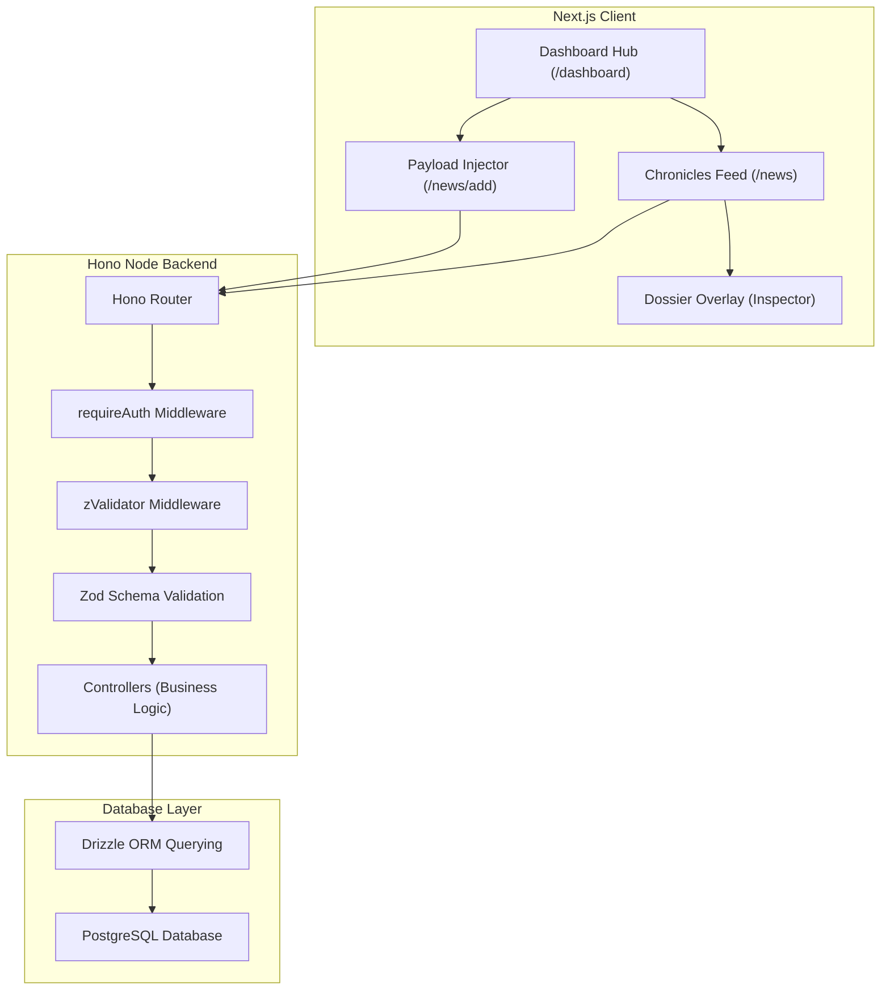

# DEV.NEWS — NEXUS CORE Command Terminal

> [!NOTE]
> DEV.NEWS is a retro-cyber themed classified intelligence broadcast platform designed for drafting, broadcasting, and managing secure news dispatches. The client application features Y2K-era tactile interfaces, CRT scanline aesthetics, and manila-folder dossier designs.

---

## 📌 Current Project Phase & Refactoring Updates

The project has transitioned from its initial setup to a modular, production-ready stage:

1. **Decoupled Data Validation (Backend Refactor):**
   - Extracted all Zod validation schemas from inline route files in [server/src/routes](file:///D:/news/adminApp/server/src/routes) into a unified [server/src/schemas](file:///D:/news/adminApp/server/src/schemas) module.
   - Any backend route can now import validation schemas interchangeably without code duplication.

2. **Dedicated Modular Routing (Frontend Refactor):**
   - Split the unified dashboard view into distinct Next.js routes to improve layout scalability and maintainability:
     - [dashboard](file:///D:/news/adminApp/client/src/app/dashboard) serves as the central Command Center and Telemetry launchpad.
     - [news](file:///D:/news/adminApp/client/src/app/news) houses the Metasphere Chronicles list, filters, search, event logs, and details inspector dossier overlay.
     - [news/add](file:///D:/news/adminApp/client/src/app/news/add) handles news payload draft composition and teletype dispatch broadcast, redirecting back to `/news` on success.

3. **TypeScript Integrity:**
   - Standardized imports matching `NodeNext` resolution rules (using strict `.js` extensions for relative TypeScript module imports).
   - Validated that both client and backend build successfully without any compilation errors.

---

## 🌟 Key Application Features

### 🔐 1. Cryptographic Authentication
- Operative authentication utilizing a one-time passcode (OTP) verification system sent to registered emails.
- Biometric verification state checks on the server to enforce operative clearance levels.

### 🎛️ 2. Command Hub Dashboard
- Telemetry logging deck rendering active system specs: Server status, Operative OS signature, Browser identifier, Operative IP address, and dynamic logs stream.
- Central deck interface routing operatives directly to the Broadcast Feed or the Payload Injector.

### 📰 3. Metasphere Chronicles Feed
- Real-time intelligence dispatch logs filtered dynamically by **Urgency level** (`INFO`, `NOTICE`, `WARNING`, `CRITICAL`).
- Search functionality querying the database news indices in real-time.
- Interactive detailed inspection dossier overlay. Operatives with clearance can modify details (`Edit Payload`) or purge transmission files completely (`Purge Transmission`).

### 🚀 4. Mainframe Payload Injector
- Teletype manual drafting screen structured around Manila folder aesthetics.
- Interactive payload injection loader showing packet compilation progress, encryption phases, and final grid broadcast sync.

### ⚙️ 5. Whitelist Email Administration
- Admin-exclusive Security Deck mapping active whitelist entries.
- Add or delete verified email coordinates to authorize or revoke operational access to the grid.

---

## 🏗️ System Architecture

The DEV.NEWS system utilizes a modern, split-layer client-server architecture built for fast runtime performance and strict schema validations.

### Architecture Topology Diagram


### Technical Stack Details

#### Frontend Client
- **Framework:** Next.js (App Router)
- **Styling:** TailwindCSS/Vanilla CSS custom overlays (scanlines, CRT screens, Manila folders, coffee stains, Win95 window shells)
- **State:** React Hooks (state & effects) with credentials-inclusive network fetches

#### Backend Server
- **Framework:** Hono (Node Server adaptor)
- **ORM:** Drizzle ORM
- **Database:** PostgreSQL
- **Security:** Session-based validation, cookie handlers, custom token validation middlewares, and request limiters
- **Data Validation:** Zod validator schemas decoupled from routes for high readability and interchangeability

---

## 📂 Project Repository Structure

- [client](file:///D:/news/adminApp/client) — Next.js Y2K Command Interface
  - [src/app](file:///D:/news/adminApp/client/src/app) — Main Next.js route folders
    - [dashboard](file:///D:/news/adminApp/client/src/app/dashboard) — Central telemetry and navigation launchpad
    - [news](file:///D:/news/adminApp/client/src/app/news) — Live feed monitoring Chronicles deck
    - [news/add](file:///D:/news/adminApp/client/src/app/news/add) — Classified dispatch draft and broadcast console
    - [settings](file:///D:/news/adminApp/client/src/app/settings) — Security whitelist deck for grid access
- [server](file:///D:/news/adminApp/server) — Hono Backend & Database Engine
  - [src/schemas](file:///D:/news/adminApp/server/src/schemas) — Centrally exported Zod schemas (Auth, News, Whitelist)
  - [src/routes](file:///D:/news/adminApp/server/src/routes) — API route definitions leveraging zValidator validation middleware
  - [src/controllers](file:///D:/news/adminApp/server/src/controllers) — Server-side operations and database querying logic
  - [src/db](file:///D:/news/adminApp/server/src/db) — PostgreSQL schema mapping declarations and Drizzle ORM configs

---

## 🚀 Getting Started

### 1. Prerequisites
- **Node.js** (v18 or higher recommended)
- **PostgreSQL** database instance running locally or hosted

### 2. Setting up the Backend
1. Go to the [server](file:///D:/news/adminApp/server) directory.
2. Initialize environment parameters inside `.env` (using `.env.example` as a template).
3. Run the migrations to initialize database tables:
   ```bash
   npm run db:generate
   npm run db:migrate
   ```
4. Start the watch dev server:
   ```bash
   npm run dev
   ```

### 3. Setting up the Frontend
1. Go to the [client](file:///D:/news/adminApp/client) directory.
2. Ensure [client/src/config.ts](file:///D:/news/adminApp/client/src/config.ts) is configured to point to your backend API URL.
3. Start the Next.js development server:
   ```bash
   npm run dev
   ```
4. Open operational grid in your browser: `http://localhost:3000`
