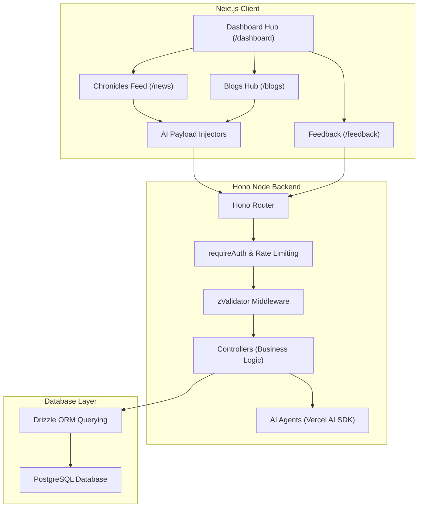

# DEV.NEWS — NEXUS CORE Command Terminal

> [!NOTE]
> DEV.NEWS is a retro-cyber themed classified intelligence broadcast platform designed for drafting, broadcasting, and managing secure news dispatches and long-form manifestos. The client application features Y2K-era tactile interfaces, CRT scanline aesthetics, and manila-folder dossier designs.

---

## 📌 Current Project Phase & Feature Integrations

The project has transitioned into a highly modular, AI-powered production stage:

1. **AI Agent Operatives (Vercel AI SDK):**
   - Integrated intelligent agent systems (`@ai-sdk/google`, `@tavily/ai-sdk`) to autonomously research, draft, and refine both News dispatches and Blog publications.
   - Dedicated `blog-agent.ts` and `news-agent.ts` modules process raw intel into formatted, production-ready payloads.

2. **Expanded Content Horizons (Blogs & Feedback):**
   - Added a full **Blogs** administration interface alongside the News feed for long-form content generation.
   - Introduced a **Feedback** terminal for telemetry and operative insights.

3. **Fortified Security & Transport Layer:**
   - Implemented strict rate-limiting (`hono-rate-limiter`) across vital API endpoints.
   - OTP transmission is now securely handled via the **Resend** email service API.
   - Refined client-side authentication routing (`/login`, `/verify`) separate from the main dashboard.

---

## 🌟 Key Application Features

### 🔐 1. Cryptographic Authentication
- Operative authentication utilizing a one-time passcode (OTP) verification system sent to registered emails via **Resend**.
- Biometric verification state checks on the server to enforce operative clearance levels.
- Strict rate-limiting defending against brute-force intrusion attempts.

### 🎛️ 2. Command Hub Dashboard
- Telemetry logging deck rendering active system specs: Server status, Operative OS signature, Browser identifier, Operative IP address, and dynamic logs stream.
- Central deck interface routing operatives directly to the Broadcast Feed, Blogs Hub, or the Payload Injector.

### 📰 3. Metasphere Chronicles Feed
- Real-time intelligence dispatch logs filtered dynamically by **Urgency level** (`INFO`, `NOTICE`, `WARNING`, `CRITICAL`).
- Search functionality querying the database news indices in real-time.
- Interactive detailed inspection dossier overlay. Operatives with clearance can modify details (`Edit Payload`) or purge transmission files completely (`Purge Transmission`).

### 🧠 4. AI-Assisted Payload Injectors (News & Blogs)
- Teletype manual drafting screens structured around Manila folder aesthetics.
- **AI Co-Pilot:** Operatives can invoke integrated AI agents to research topics (via Tavily) and draft robust content automatically.
- Interactive payload injection loader showing packet compilation progress, encryption phases, and final grid broadcast sync.

### ⚙️ 5. Whitelist Email Administration
- Admin-exclusive Security Deck mapping active whitelist entries.
- Add or delete verified email coordinates to authorize or revoke operational access to the grid.

---

## 🏗️ System Architecture

The DEV.NEWS system utilizes a modern, split-layer client-server architecture built for fast runtime performance, strict schema validations, and AI flexibility.

### Architecture Topology Diagram


### Technical Stack Details

#### Frontend Client
- **Framework:** Next.js (App Router)
- **Styling:** TailwindCSS/Vanilla CSS custom overlays (scanlines, CRT screens, Manila folders, coffee stains, Win95 window shells)
- **State:** React Hooks (state & effects) with credentials-inclusive network fetches

#### Backend Server
- **Framework:** Hono (Node Server adaptor)
- **AI Intelligence:** Vercel AI SDK (`@ai-sdk/google`, `ai`, `@tavily/ai-sdk`)
- **Email Service:** Resend API
- **ORM:** Drizzle ORM
- **Database:** PostgreSQL
- **Security:** Session-based validation, cookie handlers, custom token validation middlewares, and `hono-rate-limiter`
- **Data Validation:** Zod validator schemas decoupled from routes for high readability and interchangeability

---

## 📂 Project Repository Structure

- [client](file:///D:/news/adminApp/client) — Next.js Y2K Command Interface
  - [src/app](file:///D:/news/adminApp/client/src/app) — Main Next.js route folders
    - [dashboard](file:///D:/news/adminApp/client/src/app/dashboard) — Central telemetry and navigation launchpad
    - [login](file:///D:/news/adminApp/client/src/app/login) & [verify](file:///D:/news/adminApp/client/src/app/verify) — Secure OTP entry protocols
    - [news](file:///D:/news/adminApp/client/src/app/news) — Live feed monitoring Chronicles deck
    - [blogs](file:///D:/news/adminApp/client/src/app/blogs) — Long-form manifesto drafting and publishing deck
    - [feedback](file:///D:/news/adminApp/client/src/app/feedback) — User feedback analysis and telemetry
    - [settings](file:///D:/news/adminApp/client/src/app/settings) — Security whitelist deck for grid access
- [server](file:///D:/news/adminApp/server) — Hono Backend & Database Engine
  - [src/schemas](file:///D:/news/adminApp/server/src/schemas) — Centrally exported Zod schemas (Auth, News, Blogs, Whitelist, Agent)
  - [src/routes](file:///D:/news/adminApp/server/src/routes) — API route definitions leveraging zValidator validation middleware
  - [src/controllers](file:///D:/news/adminApp/server/src/controllers) — Server-side operations and database querying logic
  - [src/lib/agents](file:///D:/news/adminApp/server/src/lib/agents) — AI logic defining generation tasks for news and blogs
  - [src/db](file:///D:/news/adminApp/server/src/db) — PostgreSQL schema mapping declarations and Drizzle ORM configs

---

## 🚀 Getting Started

### 1. Prerequisites
- **Node.js** (v18 or higher recommended)
- **PostgreSQL** database instance running locally or hosted

### 2. Setting up the Backend
1. Go to the [server](file:///D:/news/adminApp/server) directory.
2. Initialize environment parameters inside `.env` (using `.env.example` as a template). Ensure to add keys for Resend and AI services if utilizing agent operatives.
3. Install dependencies:
   ```bash
   npm install
   ```
4. Run the migrations to initialize database tables:
   ```bash
   npm run db:generate
   npm run db:migrate
   ```
5. Start the watch dev server:
   ```bash
   npm run dev
   ```

### 3. Setting up the Frontend
1. Go to the [client](file:///D:/news/adminApp/client) directory.
2. Install dependencies:
   ```bash
   npm install
   ```
3. Start the Next.js development server:
   ```bash
   npm run dev
   ```
4. Open operational grid in your browser: `http://localhost:3000`
